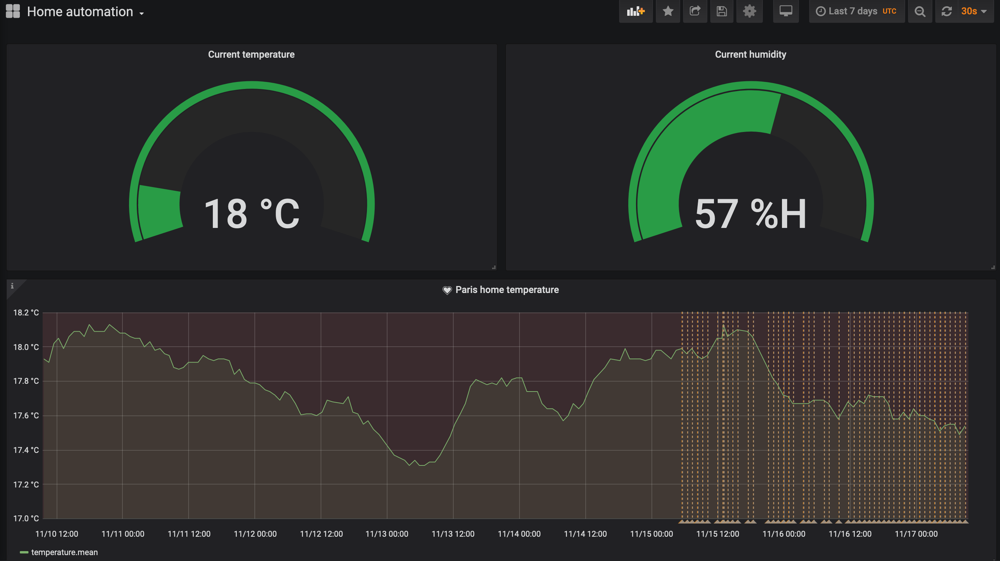

# xiaomi-get-temperature
This is my first ever Python project. "Done is better than. perfect" - M. Zuckerberg  
Get temperature and humidity values from Xiaomi Mi Home (LUMI) gateway and insert them into an influxDB database.

## GET
Once a temperature change is detected by the sensor, Xiaomi Mi Home gateway sends UDP datagram on multicast group 224.0.0.50 port 9898  
This script opens a multicast UDP socket to listen those datagrams and parse them. This is an extract of RAW output

`
[('192.168.1.16', 4321)] {"cmd":"heartbeat","model":"gateway","sid":"7811dce1823a","short_id":"0","token":"3aUVs4IhIhIcd7Vz","data":"{\"ip\":\"192.168.1.16\"}"}
[('192.168.1.16', 4321)] {"cmd":"report","model":"sensor_ht","sid":"158d0001f58aa3","short_id":54230,"data":"{\"temperature\":\"1611\"}"}
Current temperature at 2020-11-06T06:48:58: 16.11*C
[{'measurement': 'temperature', 'tags': {'host': 'xiaomi', 'region': 'paris'}, 'time': '2020-11-06T06:48:58', 'fields': {'value': 16.11}}]
[('192.168.1.16', 4321)] {"cmd":"report","model":"sensor_ht","sid":"158d0001f58aa3","short_id":54230,"data":"{\"humidity\":\"4467\"}"}
Current humidity at 2020-11-06T06:48:58: 44.67%
[{'measurement': 'humidity', 'tags': {'host': 'xiaomi', 'region': 'paris'}, 'time': '2020-11-06T06:48:58', 'fields': {'value': 44.67}}]
[('192.168.1.16', 4321)] {"cmd":"heartbeat","model":"sensor_ht","sid":"158d0001f58aa3","short_id":54230,"data":"{\"voltage\":2775,\"temperature\":\"1611\",\"humidity\":\"4467\"}"}
`

## PARSE
A function will parse the RAW output and look for temperature and humidity values for a given timestamp. Data is structured in JSON to later inject in influxDB. Here is an example of JSON output for temperature:

`
json_body = [
    {
        "measurement": "temperature",
        "tags": {
            "host": "xiaomi",
            "region": "paris"
        },
        "time": "2009-11-10T23:00:00Z",
        "fields": {
            "value": 23.51
        }
    }
]
`

## ANALYZE
There is no data analysis at the moment. Grafana thresholds are used instead to trigger some actions.

## OUTPUT
Temperature and humidity values are sent to a a remote influxDB TSDB. Values are inserted in home-monitoring database. influxDB installation and configuration is out of scope.  
Once values are populated in influxDB, grafana is used to display temperature and humidity evolution. A simple dashboard is shared in this repository.

## References
- InfluxDB Python to push temperature and humidity to a TSDB database: [https://github.com/influxdata/influxdb-python](https://github.com/influxdata/influxdb-python)
- Xiaomi API: [https://aqara.gitbooks.io/lumi-gateway-lan-communication-api/content/message-example/temperature-and-humidity-sensor.html](https://aqara.gitbooks.io/lumi-gateway-lan-communication-api/content/message-example/temperature-and-humidity-sensor.html)
- Enable Xiaomi Mi Home network functions (API): [http://www.justsmarthomes.com/viewtopic.php?t=3269](http://www.justsmarthomes.com/viewtopic.php?t=3269)
- InfluxDB + grafana installation: [https://towardsdatascience.com/get-system-metrics-for-5-min-with-docker-telegraf-influxdb-and-grafana-97cfd957f0ac](https://towardsdatascience.com/get-system-metrics-for-5-min-with-docker-telegraf-influxdb-and-grafana-97cfd957f0ac)
